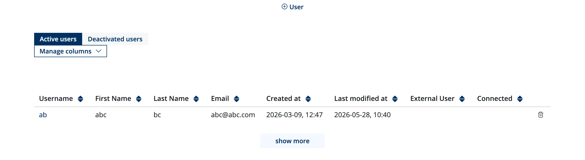
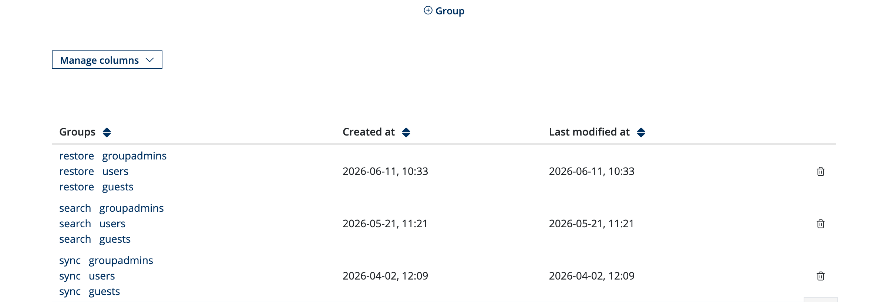
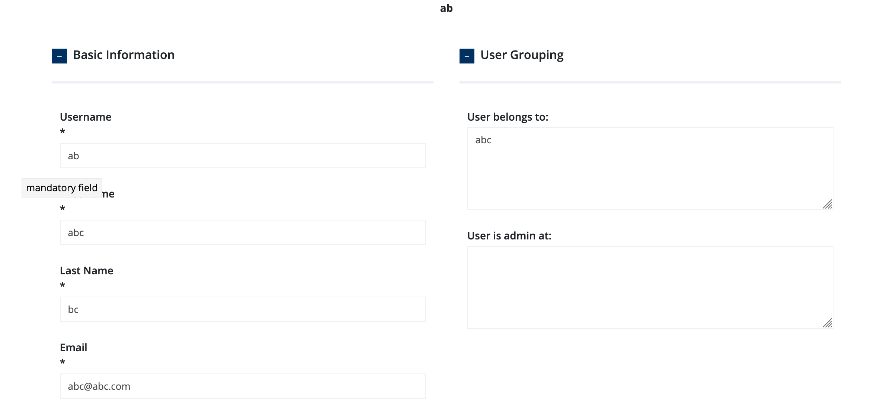

Admin Guide
============
.. _admin_guide:

.. role:: code-py(code)
   :language: Python

Labbook Query Mode
------------------

.. caution::

   Choose your mode before creating data. Switching modes after groups and labbooks
   have been created may cause users to lose (or gain) access to labbooks, because the
   prefix-based vs. exact-match semantics fundamentally differ.

The :code-py:`LABBOOK_QUERY_MODE` setting controls how the backend resolves which labbooks a user can access, and which privileges they have on those labbooks.
It is defined in ``joeseln_backend/conf/base_conf.py``:

.. code-block:: python

   # two modes: match and equal
   LABBOOK_QUERY_MODE = "equal"

.. _labbook-match-mode:

Match Mode
~~~~~~~~~~

In **match mode**, the relationship between a labbook and a group is resolved by **prefix matching** (SQL ``startswith``).
A user's group name is treated as a prefix — the system checks whether the labbook's ``owner_group`` string **starts with** the user's group name.

For example, a user who belongs to group ``"PANDA"`` can access labbooks whose ``owner_group`` is:

- ``"PANDA"``
- ``"PANDA_x"``
- ``"PANDA_xxx"``

This enables a **hierarchical** group structure. Parent groups automatically inherit access to labbooks owned by child subgroups.

.. _labbook-equal-mode:

Equal Mode
~~~~~~~~~~

In **equal mode**, the relationship is resolved by **exact string equality** (SQL ``==`` or ``in_``).
A user's group name must **exactly equal** the labbook's ``owner_group``.

For example, a user in group ``"PANDA"`` can only access labbooks whose ``owner_group`` is literally ``"PANDA"``.

This treats groups as **flat** — there is no hierarchy or prefix relationship.

Group Roles
-----------

Each user in a group can hold roles that determine what they can do within that group's labbooks.
There are three group-level roles,:

.. list-table::
   :header-rows: 1

   * - Role
     - Description
   * - ``user``
     - Create, read, edit, trash, and restore elements in labbooks belonging to the group
   * - ``groupadmin``
     - All rights of ``user`` plus: labbook versioning, delete/trash/restore of instrument (admin-created) elements
   * - ``guest``
     - Read-only access to elements created by group members and instruments

**site-wide admin** — is not a group role but a boolean flag (``User.admin``) that bypasses all checks and grants ``fullAccess: True`` on everything.

.. _group-role-guest:

Guest
~~~~~

.. note::

   groupguest role can be manually added to a user who is **outside** the group

The guest role provides **read-only** access at the labbook level. Guests can see labbooks in their group's listing, but at the element level their privilege dict grants no write access of any kind:

.. code-block:: python

   # guest_privileges/privileges_service.py
   GUEST = {
       'fullAccess': False, 
       'view': False, 
       'edit': False,
       'delete': False,
       'trash': False, 
       'restore': False,
   }

.. _group-role-user:

User
~~~~

The **user** role is the standard role for group members who actively work with labbook data.
Its privileges differ depending on who created the element:

**Elements created by regular users** (``USER_*`` dicts):

.. code-block:: python

   # user_privileges/privileges_service.py
   USER_NOTES_USER = USER_FILES_USER = USER_PICS_USER = {
       'fullAccess': True,
       'view': True,
       'edit': True,
       'delete': True,
       'trash': True,
       'restore': True,
   }

Users have **full control** over elements created by themselves or other group members.

**Elements created by site-wide admins / instruments** (``ADMIN_*`` dicts):

.. list-table::
   :header-rows: 1

   * - Element type
     - View
     - Edit
     - Delete
     - Trash
     - Restore
   * - Notes (``ADMIN_NOTES_USER``)
     - ✓
     - ✗
     - ✗
     - ✗
     - ✗
   * - Files (``ADMIN_FILES_USER``)
     - ✓
     - ✗
     - ✗
     - ✗
     - ✗
   * - Pictures (``ADMIN_PICS_USER``)
     - ✓
     - ✓ (add shapes)
     - ✗
     - ✗
     - ✗

Users can view admin-created notes and files, but cannot modify, delete, or restore them.
Pictures are an exception — users can edit them to add annotations/shapes on instrument background images.

.. _group-role-groupadmin:

Group Admin
~~~~~~~~~~~

.. note::

   a user must first be a groupuser then promoted to groupadmin

The **groupadmin** role extends the user role with additional management rights.
The key difference is control over **admin-created elements** (instrument data) and **labbook versioning**.

**Admin-created / instrument elements** — groupadmins can delete, trash, and restore what users can only view:

.. list-table::
   :header-rows: 1

   * - Element type
     - View
     - Edit
     - Delete
     - Trash
     - Restore
   * - Notes (``ADMIN_NOTES_GROUPADMIN``)
     - ✓
     - ✗
     - ✓
     - ✓
     - ✓
   * - Files (``ADMIN_FILES_GROUPADMIN``)
     - ✓
     - ✗
     - ✓
     - ✓
     - ✓
   * - Pictures (``ADMIN_PICS_GROUPADMIN``)
     - ✓
     - ✓ (add shapes)
     - ✓
     - ✓
     - ✓

This allows groupadmins to clean up incorrect or unwanted instrument data on behalf of the group.

**Labbook-level privileges** 
groupadmin also have access to labbook versioning: creating versions, restoring
previous versions, and previewing historical versions.

.. _group-role-site-admin:

Site-wide Admin
~~~~~~~~~~~~~~~

A site-wide admin (``User.admin == True``) is not tied to any group and bypasses all permission checks:

.. code-block:: python

   # admin_privileges/privileges_service.py
   ADMIN = {
       'fullAccess': True,
       'view': True,
       'edit': True,
       'delete': True,
       'trash': True,
       'restore': True,
   }

Site-wide admins can manage group membership (add/remove users and change roles), edit labbook metadata, and perform all operations across all groups.

.. _group-role-summary:

Summary
~~~~~~~

.. list-table::
   :header-rows: 1

   * - Capability
     - Guest
     - User
     - Group Admin
     - Site Admin
   * - View labbook listing
     - ✓
     - ✓
     - ✓
     - ✓
   * - Create elements
     - ✗
     - ✓
     - ✓
     - ✓
   * - Edit own / other users' elements
     - ✗
     - ✓
     - ✓
     - ✓
   * - Delete, trash, restore user elements
     - ✗
     - ✓
     - ✓
     - ✓
   * - View admin/instrument elements
     - ✗
     - ✓
     - ✓
     - ✓
   * - Edit admin/instrument pics (shapes)
     - ✗
     - ✓
     - ✓
     - ✓
   * - Delete, trash, restore admin elements
     - ✗
     - ✗
     - ✓
     - ✓
   * - Labbook versioning (version, restore, preview)
     - ✗
     - ✗
     - ✓
     - ✓
   * - Edit labbook metadata
     - ✗
     - ✗
     - ✗
     - ✓
   * - Manage group membership
     - ✗
     - ✗
     - ✗
     - ✓

User Management
-----------------------

Admins can manage users, groups, and group memberships manually through the admin
interface at ``/admin``.

.. _gui-user-crud:

Users
~~~~~

**User list** —shows all registe users

**Create a user.** When creating a user, the following fields are required:

- **Username** — login name (must be unique)
- **Email** — email address
- **First name** and **Last name**
- **Password** — must be confirmed by typing it twice

.. note::

   For OIDC users, accounts are created
   automatically during the first successful Keycloak login. You do not need
   to create OIDC users manually.

**Soft-delete a user** — soft-deleting a user marks them as ``deleted`` in the
database without removing their data. Soft-deleted users:

- Cannot log in
- Cannot access any labbook or element
- **Their created labbooks, elements, and other data remain intact**

**Restore a user** — restores a soft-deleted user

.. _gui-admin-management:

Site-wide Admins
~~~~~~~~~~~~~~~~

**View admins** — a listing shows all site-wide admins

**Promote to admin** — promotes an existing (non-deleted) user to site-wide
admin. Once promoted, the user bypasses all permission checks.

**Demote from admin** — removes the site-wide admin role from a user.

.. warning::

   Demoting an admin does not delete the user account — it only clears the
   admin flag. The user continues to exist with their group memberships intact.

.. _gui-group-management:

Groups
~~~~~~

**Group list** — the lists all groups with their name, creation
date, and a flag indicating whether the group is empty (has no members).

**Create a group** — a group requires a **group name**. Groups are used to
organize users and control access to labbooks (see :ref:`labbook-equal-mode` and
:ref:`labbook-match-mode`).

**Soft-delete a group** — marks a group as deleted. The group is hidden from
listings but its historical association with labbooks and users is preserved.

.. _gui-user-privileges:

Individual User Management
~~~~~~~~~~~~~~~~~~~~~~~~~~~

Admin may edit a user in user detail page:

**Edit a user** — admins can update a user's username, email, first name, and
last name.

.. note::

   For OIDC users, their data are provided via Keycloak and not editable in ELN.

**Reset a user's password**

It also display the resolved permissions for a specific user.
You may see all groups that user has access on.

.. note::

   When :ref:`labbook-match-mode` is enable, the access control hierarchy is shown in trees.

OIDC / Keycloak Group Sync
--------------------------

When Keycloak SSO is enabled, user group membership is automatically synced from Keycloak to the
internal database during each Keycloak login. This section explains how the sync works.

.. note::

  The sync is **not** periodic or event-driven — it runs once per Keycloak login.

.. _oidc-sync-mapping:

Group Mapping
~~~~~~~~~~~~~

All **Keycloak realm roles** are mapped directly to internal group names.
For example, if a user has Keycloak realm roles ``["PANDA", "MIRA"]``, the sync will
create (if missing) and add the user to internal groups named ``"PANDA"`` and ``"MIRA"``.

.. note::

  Keycloak roles are mapped to the internal ``user`` group role. The ``groupadmin`` and ``guest`` roles are never set by the sync — they are only
  managed through the admin UI.

.. _oidc-sync-algorithm:

Sync Process
~~~~~~~~~~~~~~

The core sync function ``update_oidc_user_groups()`` (in
``services/user_to_group/user_to_group_service.py``) works in two phases:

**Phase A — Add / ensure groups from Keycloak:**

For each group name from ``realm_access.roles``:

1. If a ``Group`` record with that name does not exist, create one.
2. If the user is not already a member with the ``user`` role in that group:
   - Remove any existing membership for that user+group
   - Add the user with role ``user`` and mark the membership as ``external=True``

**Phase B — Remove stale groups:**

For each internal group the user currently belongs to (with the ``user`` role) that is **not**
present in the Keycloak roles:

1. Attempt to remove the user from that group, but **only** if the membership was marked
   ``external=True`` (i.e., originally sourced from SSO)
2. If removal succeeds, also remove any ``groupadmin`` role the user held in that group

.. _oidc-external-flag:

The ``external`` Flag
~~~~~~~~~~~~~~~~~~~~~

Each ``UserToGroupRole`` record has an ``external`` boolean column:

- ``external=True`` — membership was created by the SSO sync
- ``external=False`` — membership was created manually via the admin UI

This flag protects **manually-assigned** group memberships from being wiped during OIDC sync.
Only SSO-sourced memberships (``external=True``) are candidates for removal in Phase B.

Labbook Import
--------------

admin may create labbooks by importing the following formats:

.. _import_zip:

ZIP Import
~~~~~~~~~~

A ZIP archive previous generated by ELN' export containing the labbook's data and binary files. The archive structure:

.. code-block::

   export.zip
   ├── {labbook_title}.json              # All element metadata (JSON)
   ├── pictures/
   │   └── {picture_uuid}/
   │       ├── bi.png                    # Background image
   │       └── info.json                 # Picture metadata + canvas content
   └── files/
       └── {file_uuid}/
           ├── {original_filename}       # Actual uploaded file
           └── info.json                 # File metadata

.. _import-lxf:

LXF Import (Labbook Exchange Format)
~~~~~~~~~~~~~~~~~~~~~~~~~~~~~~~~~~~~

A ZIP archive with multiple **individual PDF pages**.
This format is designed for interoperability with other notebook systems.

.. code-block::

   export.lxf
   ├── manifest.json                     # {"version": "1.0", "pages": [...]}
   └── pages/
       ├── {uuid}.pdf                    # One PDF per element
       ├── {uuid}.pdf
       └── ...

Each PDF page is added as and picture element at import

