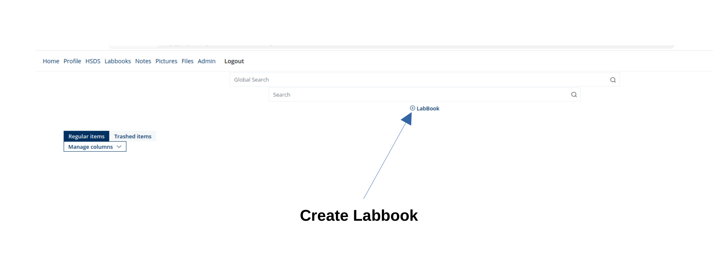
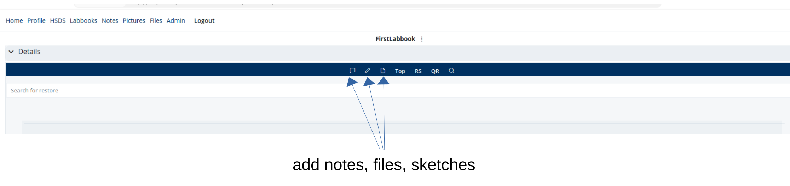

Installation
=============

Repositories
------------

The project consists of two separate repositories:

* Backend: https://github.com/mlz-cisx/eln-backend
* Frontend: https://github.com/mlz-cisx/eln-frontend

Clone both repositories:

.. code-block::

    git clone https://github.com/mlz-cisx/eln-backend backend
    git clone https://github.com/mlz-cisx/eln-frontend frontend

.. note::
    The complete ``docker-compose`` setup (backend, frontend, and all
    supporting services such as PostgreSQL, Typesense, and Playwright)
    is located in the **backend** repository under ``backend/docker-compose.yml``.

.. tip::
    The backend repository contains ``.env.sample`` and ``.env.postgres-sample`` files.
    Use them as templates for creating your own ``.env`` and ``.env.postgres`` configurations.

Docker
------

.. tip::
    It is recommended to use Docker for deployment.

* `Install Docker`_ for your system
* Adjust parameter in ``.env`` and ``docker-compose.yml`` according to :doc:`configuration`

.. code-block::

      # copy docker-compose to parent folder, the file structure should be
      # .
      # ├── frontend/
      # │   └── Dockerfile
      # ├── backend/
      # │   └── Dockerfile
      # └── docker-compose.yml
      cp docker-compose.yaml ..

      # build both frontend and backend images
      docker-compose build

      # start all services
      docker-compose up

.. _install-from-source:

From Source code
----------------

.. _target:

* System requirements: Python 3.13 , Node 24
* Refer to offcial installation guides, install `PostgreSQL`_, `Typesense`_, and `Playwright`_
* Adjust parameter in ``backend/.env`` and  ``frontend/source/assets/config/env.js`` according to :doc:`configuration`

.. tip::
    Both the **backend** and **frontend** repositories contain detailed
    ``README`` files describing installation from source, development setup,
    and additional environment configuration.
    These READMEs complement the instructions below and provide further
    guidance for advanced or platform-specific setups.

.. code-block::

    # install necessary system dependency
    apt install python3-pip poppler-utils

    # install backend envriroment
    cd backend && pip install -r requirement.txt

    # install frontend dependency
    cd frontend && npm install

    # start backend service
    cd backend && uvicorn main:app --reload --port 8010 --host 0.0.0.0 --loop asyncio

    # build frontend and start a development server
    cd frontend && npx ng serve

First Steps
-----------

* Login as user **admin** or as user **instrument** with the initial password ``secret``
* Change passwords under **Profile** for security reasons
* Navigate to **Labbooks** Page
* Create a new **Labbook**

* Add notes , files, sketches to the labbook

* Have a look at the :ref:`Admin Guide <admin_guide>` for more information.

.. _Install Docker: https://docs.docker.com/engine/install/
.. _PostgreSQL: https://www.postgresql.org/docs/current/tutorial-install.html
.. _Typesense: https://typesense.org/docs/guide/install-typesense.html
.. _Playwright: https://playwright.dev/python/docs/intro

