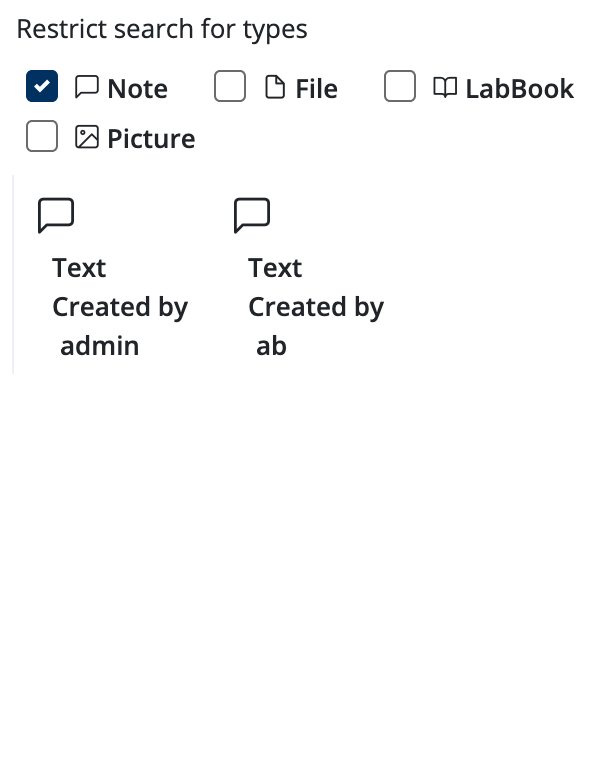
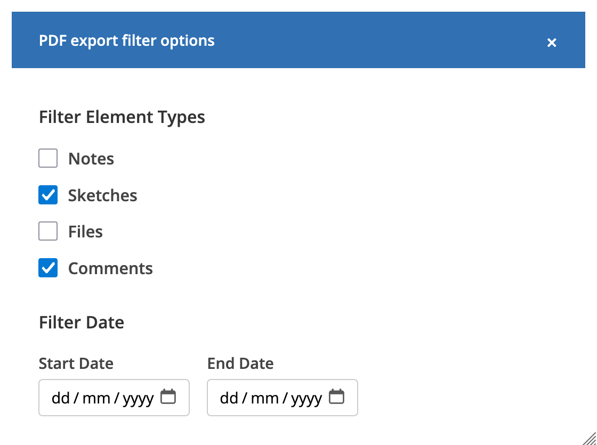
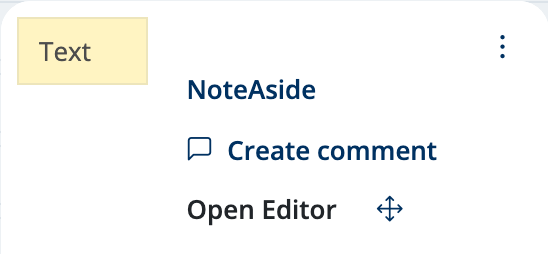
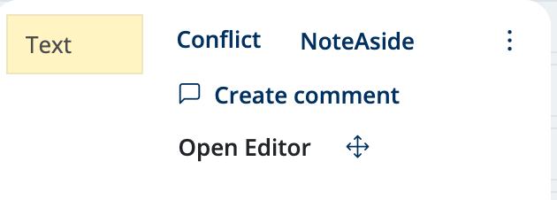
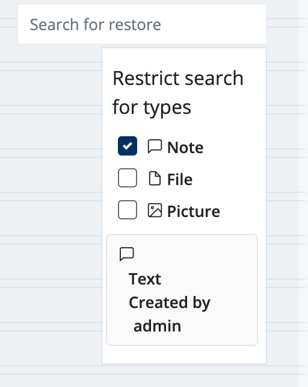
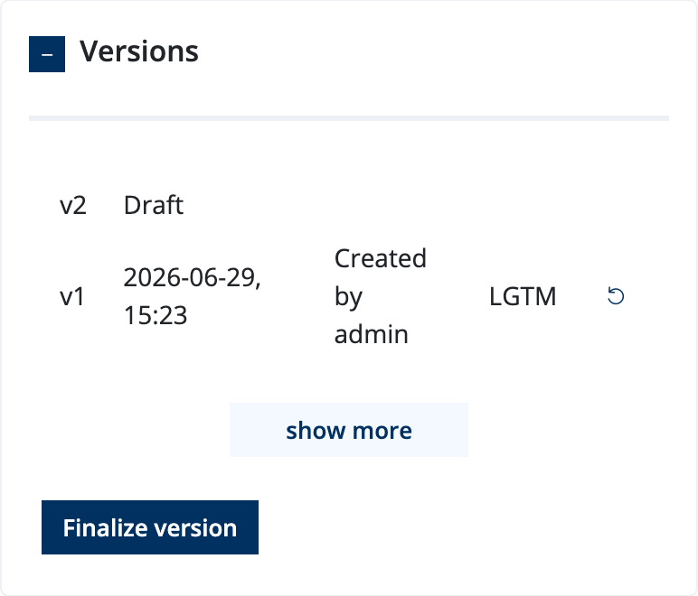
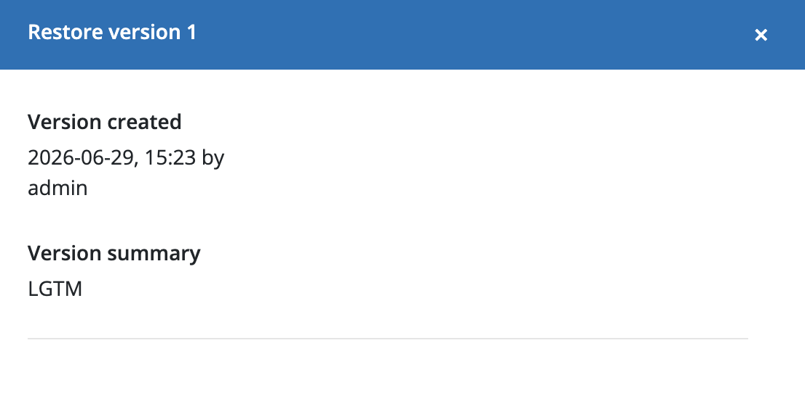
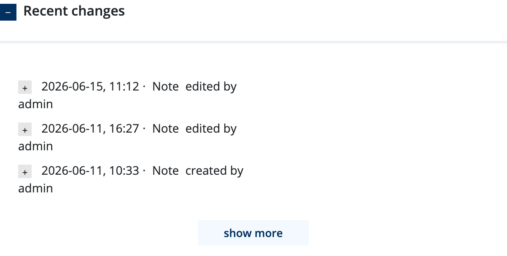

User Guide
=============

.. role:: code-py(code)
   :language: Python

.. role:: code-js(code)
   :language: Javascript

Global Search
-------------

The ELN provides a global search feature that allows you to quickly find
content across all labbooks you have access to. The search bar is located
in the navigation bar at the top of the **labboks page**

Usage
^^^^^^^^^^^^^^^^

As you type in the search bar, the search is triggered automatically.
You can choose to search specific content types using the filter
checkboxes in the search dropdown:

* **Notes** — searches note subject and body
* **Files** — searches file title and description
* **Labbooks** — searches labbook title and description
* **Pictures** — searches picture title and **any text annotation in drawings**

Search results are displayed in a dropdown list below the search bar.
Each result shows:

* an icon indicating the content type (note, file, labbook, or picture)
* the title or name of the matching item
* the user who created the item

Clicking a result navigates you to the labbook containing that element
and scrolls directly to its position.

Labbook Export
--------------

Labbooks can be exported in three formats from the :guilabel:`Export` menu
in the labbook's details (⋮) dropdown.

Export Filter
^^^^^^^^^^^^^^^^^^^^^

All export formats present a dialog before starting where you can optionally
filter the content:

* **Content types** — choose which element types to include:
  Notes, Sketches (Pictures), Files, and/or Comments
* **Date range** — restrict to elements created within a specific time
  window (start and end date)

.. caution::
  If no filters are applied, all content is exported with comments.

.. tip::

   For large labbooks, the export may take a few moments.
   You will get a downloaded once export is completed.

PDF Export
^^^^^^^^^^

The **PDF export** renders the entire labbook as a single PDF document
of A4 pages. Notes, pictures, and files are converted to pages in the original 
order.

ZIP Export
^^^^^^^^^^

The **ZIP export** creates an archive containing the original files and
picture backgrounds, together with a structured metadata file for
machine-readable processing.

The archive structure::

   labbook-title.zip
   ├── files/
   │   └── <element-uuid>/
   │       ├── <original-filename>
   │       └── info.json          (title, name, file_size, description, mime_type)
   ├── pictures/
   │   └── <element-uuid>/
   │       ├── bi.png             (background image)
   │       └── info.json          (title, display, canvas_content)
   └── <labbook-title>.json       (full element metadata)

.. tip::
   this format can be later re-import to ELN as a new labbook (require admin role, see :ref:`import_zip`)

LxF Export (Labbook eXchange Format)
^^^^^^^^^^^^^^^^^^^^^^^^^^^^^^^^^^^^^

The **LxF export** is an exchange format designed for archiving
and interoperability. Each labbook element is rendered as an individual
PDF page, and the pages are bundled into a structured ZIP archive with a
manifest.

The archive structure::

   labbook-title.lxf
   ├── pages/
   │   ├── <uuid-1>.pdf
   │   ├── <uuid-2>.pdf
   │   └── ...
   └── manifest.json              (page index with title and creation date)

The manifest uses the following schema:

.. code-block:: json

   {
     "version": "1.0",
     "pages": [
       {
         "uuid": "550e8400-e29b-41d4-a716-446655440000",
         "title": "Synthesis Notes",
         "created_at": "2026-06-28T14:30:00Z"
       }
     ]
   }

Individual element export
^^^^^^^^^^^^^^^^^^^^^^^^^

Individual notes, files, and pictures can also be exported as PDF with comments
directly from the element's own dropdown menu.

Labbook Layout
--------------

Labbook content is arranged on a grid-based canvas. Each element (note,
file, or sketch) occupies a rectangular cell on this grid, and you
can freely arrange them.

Dragging elements
^^^^^^^^^^^^^^^^^

To move an element, click and hold the **drag handle** in
the element's header, then drag it to a new position.

Resizing elements
^^^^^^^^^^^^^^^^^

Hover over the bottom or right edge of an element to reveal the resize
handle. Drag to adjust the element's width and height.

.. tip::
  Positions are saved automatically one second after you finish
  moving or resizing — no manual save is needed.

Adding new elements
^^^^^^^^^^^^^^^^^^^

New elements can be added in several ways:

* Click the **note**, **sketch**, or
  **file** buttons on the sidebar to create
* **Double-click** the grid to open the element picker
  and insert a new element at that row

Note Aside
^^^^^^^^^^

The :guilabel:`NoteAside` button (available in the toolbar of any element)
creates an empty note to the right of the current note, filling the
remaining columns. This is useful for placing supplementary information —
like a calculation or a comment — side by side with the main note.

Restructure
^^^^^^^^^^^

Over time, dragging and resizing elements can leave empty gaps in the
labbook layout. The **Restructure** button (labelled :guilabel:`RS` in
the sidebar) compacts the layout by removing all empty vertical space
between elements.

Live Collaboration
-------------

The ELN supports real-time collaboration through a Server-Sent Events
connection. When multiple users work on the same labbook simultaneously,
changes are propagated automatically so everyone sees an up-to-date view.

Live reload
^^^^^^^^^^^

Whenever another user adds, moves, resizes, or deletes an element, the
grid refreshes automatically a short moment after the change. The update
is seamless:

* **New elements** appear in the grid at their correct position,
  and a toast notification offers to :guilabel:`click and jump` to them
* **Deleted elements** disappear from the grid
* **Edited elements** automatically update

Conflict indication
^^^^^^^^^^^^^^^^^^^

When editing a note that is also being edited by another user,
a :guilabel:`Conflict` badge appears in the note.

.. tip::
  This mechanism ensures that team members working on the same labbook
  do not silently overwrite each other's work.

Search to Restore
-----------------

When an element is deleted in a labbook, it is not permanently removed.
You can search through these deleted elements and drag them back to restore them.

.. tip::

   When enable :guilabel:`auto-hide content in electronic log` in NICOS, you may use this method
   to manually arrange labbook content.

Accessing the restore search
^^^^^^^^^^^^^^^^^^^^^^^^^^^^

The restore search bar is located at the top right of the labbook page.

Restoring by drag and drop
^^^^^^^^^^^^^^^^^^^^^^^^^^

Search results can be dragged directly from the results list onto the grid:

1. **Search** for the deleted element by keyword
2. **Drag** the result from the search dropdown
3. **Drop** it onto the labbook grid at the desired row position
4. The element is restored and reappears in the grid at that location

.. note::

   Only elements that were soft-deleted within the current working
   labbook are shown.

Labbook Versioning
----------

Labbooks support snapshot versioning. A version captures the full
state of a labbook — including all elements, their content, and their
positions — at a specific point in time. You can later preview or
restore any version.

Creating a version (Finalize)
^^^^^^^^^^^^^^^^^^^^^^^^^^^^^

Versions are managed from the labbook's details panel. In the
:guilabel:`Versions` section, click the :guilabel:`Finalize Version` button
to create a snapshot of the current labbook state.

A dialog asks for a **summary** describing what this version captures
(e.g. "Initial synthesis results" or "Post-review update"). After
confirming, a new version is created with an incrementing number.

Restoring a version
^^^^^^^^^^^^^^^^^^^^^^^^^^^^^^^^^^

1. Reverts all element content (notes, pictures, files) to their
   versioned state
2. Restores the element positions (x, y, width, height) as they were
   at that version
3. Removes any elements that were added after the version was created
4. Creates a new version entry recording the restore operation

After restoration, the page reloads to reflect the restored state.

.. caution::

   Restoring a version is a destructive operation — any changes made
   since the restored version will be lost. A restore event is recorded
   as a new version so you can undo it if needed.

.. tip::

   Finalizing a version requires **admin** or **group admin** privileges
   on the labbook. Regular users can view the version history but cannot
   create or restore versions.

Element-level version
^^^^^^^^^^^^^^^^^^^^^

In addition to labbook-level versioning, individual elements (notes,
files, pictures) can also be versioned. From the element's
dropdown menu, select :guilabel:`Metadata` to apply version / restore

There is also a tracking of editing history,

* What field was changed
* The old and new values
* Who made the change and when

.. tip::
  This history is read-only and cannot be reverted directly.
  Use versioning for more robust bookkeeping.
